# Bundle Deal Editor — Staff Guide

**Last updated:** 2026-03-11 · **Version:** 1.1

> Screenshots can be regenerated with `npm run screenshots --prefix monitor`.
> See [docs/screenshots/README.md](docs/screenshots/README.md) for details.

---

## What are bundles?

Bundles are deals you create to offer customers special pricing on groups of products. For example:

- "Any 4 Drinks — $20"
- "Mix & Match 1g Pre-Rolls — 3 for $25"
- "Monday Munchdays — Edibles $12.50 each"

When a bundle is active, customers see it as a deal button on the relevant product page (Flower, Edibles, etc.). They can tap it to see which products qualify and add items to their cart.

---

## Getting to the bundle editor

Go to **/bundles** in your browser (e.g., `menu2.highhopesma.com/bundles`). This is an admin-only page — it doesn't appear on the kiosk navigation.

You'll see a list of all existing bundles organized by category (Flower, Pre-Rolls, Edibles, etc.).

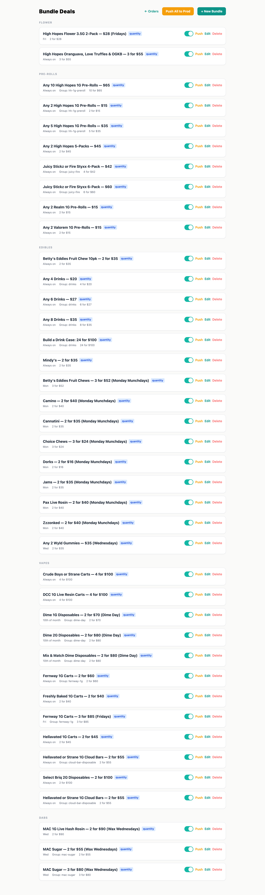

---

## Bundle types

There are two types of deals:

### Quantity deals
"Buy N items for a fixed price." The customer needs to add a specific number of matching products to unlock the deal.

Example: **Any 4 Drinks — $20** — the customer adds 4 qualifying drinks to their cart and pays $20 total instead of full price.

### Timed deals
"Special per-item price on certain days." Every matching product gets a reduced price during the scheduled window. No minimum quantity needed.

Example: **Monday Munchdays — Edibles $12.50/ea** — every qualifying edible is priced at $12.50 on Mondays.

Each bundle card shows its type as a colored badge — blue for **quantity**, purple for **timed**.

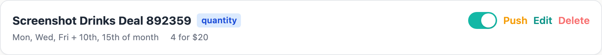

---

## Creating a new bundle

1. Click **+ New Bundle** in the top right corner.

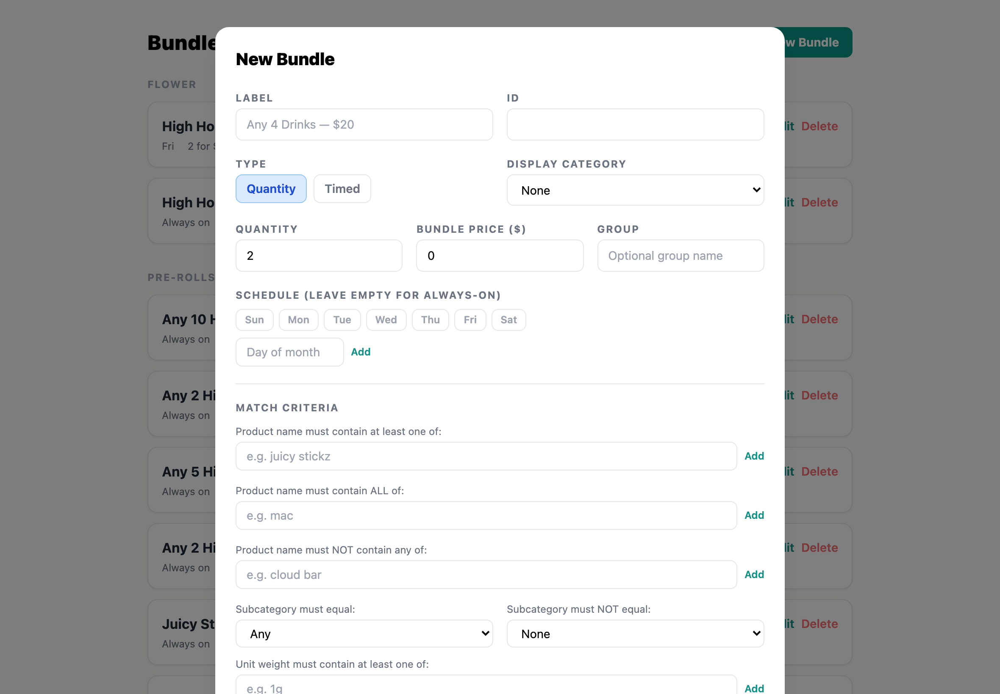

2. Fill in the form:

   **Label** — The name customers will see on the deal button. Make it descriptive.
   Example: "Any 4 Drinks — $20"

   **ID** — Auto-generated from the label. You usually don't need to change this.

   **Type** — Choose **Quantity** or **Timed**.

   **Display Category** — Which section this bundle appears under on the admin page (Flower, Pre-Rolls, Edibles, Vapes, Dabs). This also determines which product page shows the deal.

3. Set the pricing:

   - For **Quantity** deals: enter the number of items needed and the total bundle price.
   - For **Timed** deals: enter the per-item price.

4. Set the schedule (optional):

   - Leave everything blank for an **always-on** deal.
   - Select **days of the week** (e.g., Mon, Wed, Fri) for recurring weekly deals.
   - Add **dates of the month** (e.g., 1st, 15th) for specific calendar dates.
   - You can combine both — the deal will be active on any selected day OR date.

   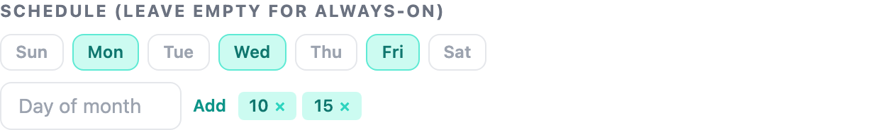

5. Set the **match criteria** — this controls which products qualify for the deal. See the next section for details.

6. Check the **live preview** at the bottom of the form. It shows how many products currently match your criteria and lists up to 8 of them by name. If you see 0 matches, adjust your criteria.

7. Click **Create**.

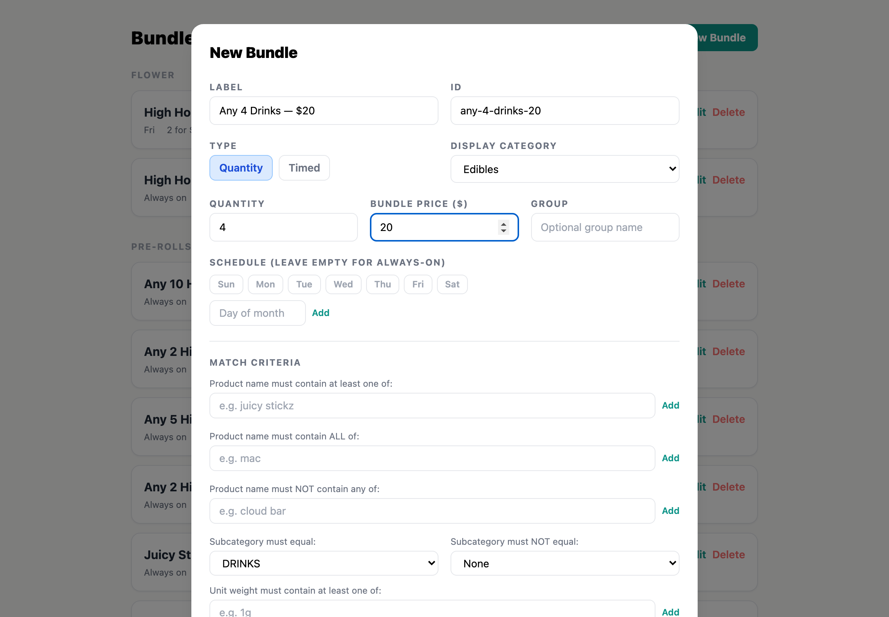

---

## Match criteria

Match criteria determine which products qualify for a deal. You can combine multiple rules — a product must satisfy **all** of them to qualify.

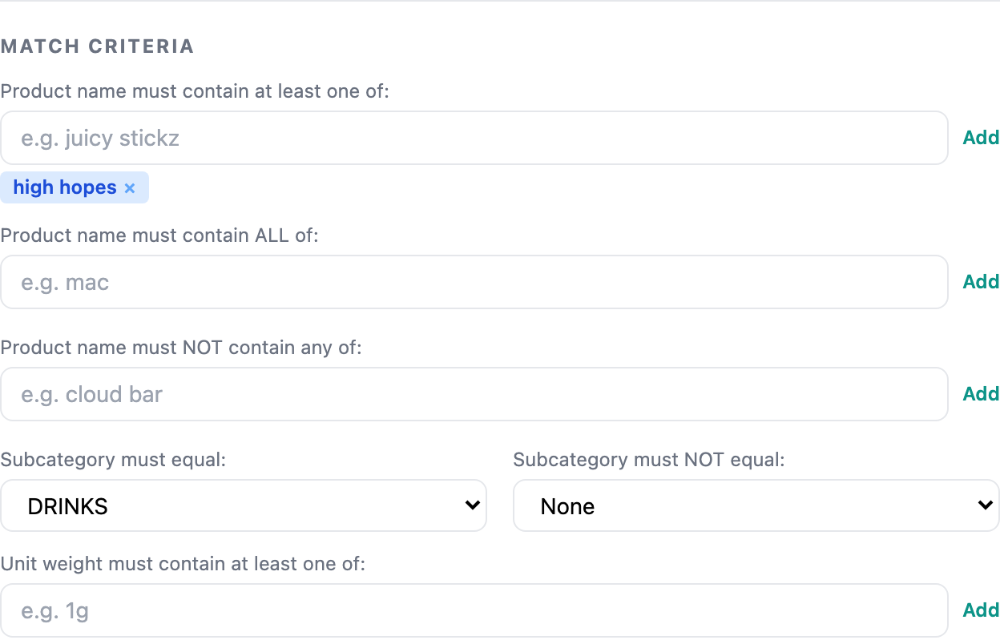

### Name contains at least one of
Products whose name includes **any** of these terms. Use this for brand names or product lines.

Example: Adding "juicy stickz" and "fire styxx" matches any product with either phrase in its name.

### Name contains ALL of
Products whose name includes **every** one of these terms. Use this to narrow results when a single term is too broad.

Example: Adding "high hopes" and "1g" matches only High Hopes products that are also 1g size.

### Name must NOT contain
Excludes products whose name includes **any** of these terms. Use this to carve out exceptions.

Example: Adding "pre-ground" excludes pre-ground products from the deal.

### Subcategory filters
Match or exclude by product subcategory (Drinks, Singles, Packs, Cartridges, Disposables, etc.).

Example: Set "must equal" to **DRINKS** to match only drink products.

### Unit weight contains
Match by size/weight. Useful for size-specific deals.

Example: Adding "1g" matches all 1-gram products.

### Tips for writing criteria

- All text matching is **case-insensitive** — "High Hopes" matches "high hopes".
- Name matching is **partial** — "hop" matches "High Hopes OG Kush".
- Start broad and use the live preview to check your matches. Add exclusions to remove unwanted products.
- If you're not seeing the products you expect, try fewer criteria first, then add more to narrow down.

---

## Groups (preventing deal stacking)

The optional **Group** field prevents multiple deals from stacking on the same products.

If two bundles share the same group name (e.g., "drinks"), only the one that saves the customer the most money will apply. This prevents situations where a customer could double-dip on overlapping deals.

Bundles without a group can stack with other bundles freely.

---

## Editing a bundle

1. Find the bundle on the **/bundles** page.
2. Click **Edit** on the bundle card.
3. Make your changes. The live preview updates in real time.
4. Click **Save Changes**.

Note: You cannot change a bundle's ID after creation.

---

## Enabling and disabling bundles

Each bundle card has a toggle button on the right side:

- **Teal toggle** = enabled (customers can see this deal)
- **Gray toggle** = disabled (hidden from customers)

Click the toggle to switch. Disabled bundles stay in the system so you can re-enable them later without recreating them. A "Disabled" badge appears on the card.

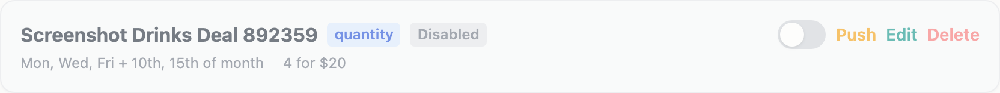

This is useful for seasonal deals — disable them when they're over, re-enable them when the season comes back.

---

## Deleting a bundle

1. Click **Delete** on the bundle card.
2. A confirmation prompt appears — click **Confirm** to permanently delete, or **Cancel** to back out.

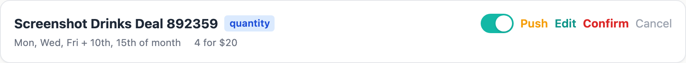

Deletion is permanent. If you might want the deal again later, consider disabling it instead.

---

## Pushing bundles from staging to production

If you're working on the **staging** site (menu2-stage.highhopesma.com), you can push bundles to the live production site:

- **Push All to Prod** — pushes every bundle to production at once.
- **Push** (on individual cards) — pushes just that one bundle.

This lets you create and test deals on staging before making them live.

---

## What customers see

When a deal is active and has matching products on a category page, customers see:

1. A row of deal buttons at the top of the page (amber/gold colored, with a party emoji).

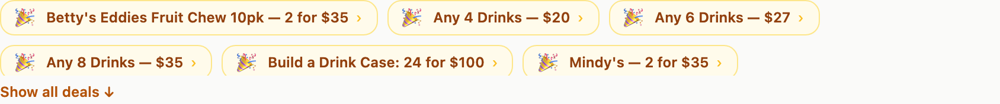

2. Tapping a quantity deal opens a **deal modal** showing:
   - All qualifying products with +/− buttons
   - A progress bar: "2 / 4 in cart"
   - A "Pick for me" button that auto-selects products to fill the deal

   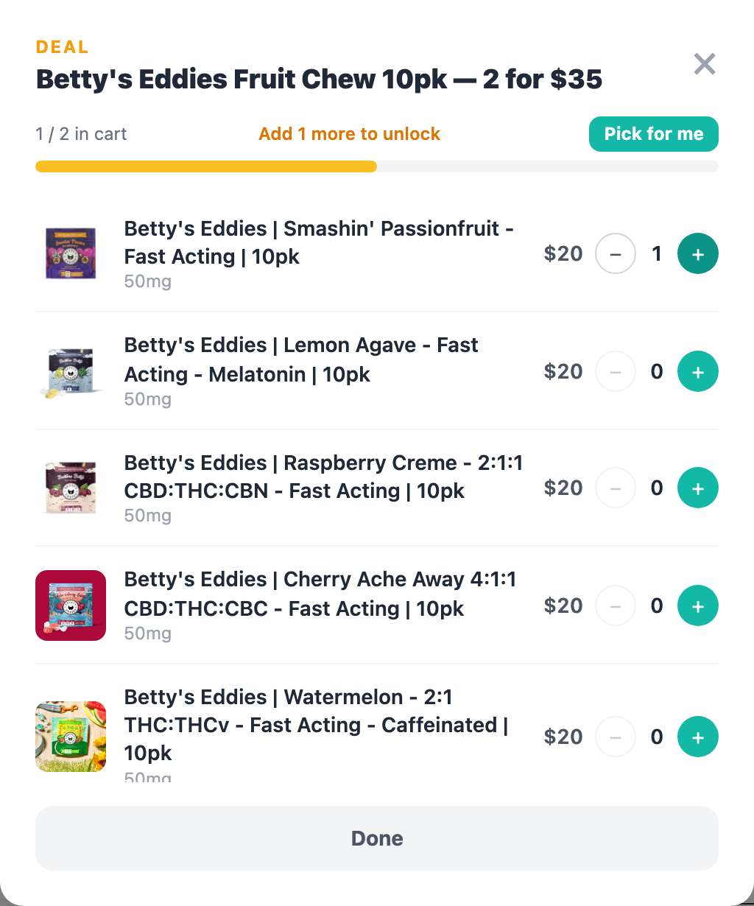

   - Fireworks animation when the deal is unlocked

   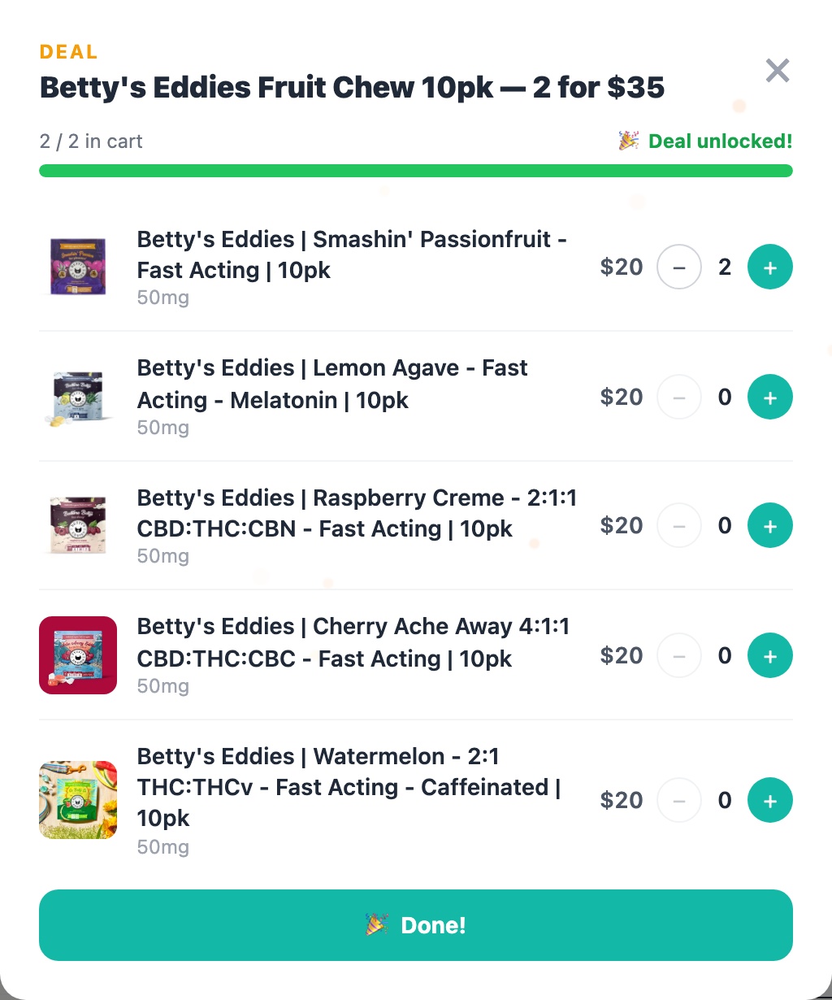

3. Timed deals appear as non-interactive labels — customers just see the special price applied to qualifying items.

If there are many active deals, only the first couple rows of buttons show, with a "Show all deals" link to expand.

---

## Common examples

### "Any 4 Drinks — $20"
- Type: **Quantity**
- Display Category: **Edibles**
- Quantity: **4**, Bundle Price: **20**
- Schedule: blank (always on)
- Criteria: Subcategory must equal **DRINKS**

### "Mix & Match 1g Pre-Rolls — 3 for $25"
- Type: **Quantity**
- Display Category: **Pre-Rolls**
- Quantity: **3**, Bundle Price: **25**
- Schedule: blank (always on)
- Criteria: Unit weight contains **1g**

### "Friday Flower Sale — $30/eighth"
- Type: **Timed**
- Display Category: **Flower**
- Unit Price: **30**
- Schedule: **Fri** selected
- Criteria: Unit weight contains **3.5g**

### "High Hopes House Brands — 4 for $40" (excluding pre-ground)
- Type: **Quantity**
- Display Category: **Flower**
- Quantity: **4**, Bundle Price: **40**
- Criteria:
  - Name contains at least one of: **high hopes**
  - Name must NOT contain: **pre-ground**

---

## Common mistakes to avoid

### Setting the bundle price higher than the regular price
If you create "4 for $60" but the four cheapest qualifying items already total $50, the deal actually costs customers more. Always check the live preview to see what products match and what they cost. The deal should be cheaper than buying the items individually.

### Criteria too broad — matching products you didn't intend
A name filter like "og" will match "OG Kush" but also "Yoga Gummies" and "Organic Tincture." Check the live preview carefully. If unexpected products appear, add exclusions or use more specific terms.

### Criteria too narrow — matching nothing
If you combine many rules, you can easily end up with zero matches. The live preview will show "(0)" if nothing qualifies. Start with one or two criteria, verify matches, then add more to narrow down.

### Forgetting the display category
If you leave Display Category blank, the deal won't appear on any customer-facing product page. It will exist in the system but customers will never see it.

### Overlapping deals without a group
If you have "4 Drinks for $20" and "6 Drinks for $28" and they don't share a group, a customer with 6 drinks could get both deals applied. Set the same **Group** (e.g., "drinks") on both so only the best-value deal applies.

### Schedule confusion — always-on when you meant limited
If you forget to set any schedule, the deal runs 24/7. If you meant it for Fridays only, make sure you actually selected **Fri** before saving. There's no warning for an empty schedule since always-on is a valid choice.

### Disabling vs deleting
If a deal is seasonal (e.g., a holiday promo), **disable** it instead of deleting it. You can re-enable it next year without rebuilding the criteria from scratch. Only delete deals you'll never use again.

### Pushing to prod before testing
If you create a deal on staging, test it there first — add qualifying products to the cart on the staging kiosk and confirm the deal activates correctly. Once you're confident, push to prod. A bad deal on production is visible to every customer immediately.

### Editing a live deal during store hours
Changes take effect immediately. If you edit criteria or pricing on a deal that customers are currently seeing, their experience changes mid-session. If you need to make significant changes, consider disabling the deal first, making your edits, then re-enabling it.

### Name matching is partial
"hop" matches "High Hopes OG Kush" but also "Bishop's Lemon Hops" or any other product with "hop" anywhere in the name. Be as specific as you need to be, and use the live preview to verify.
