# High Hopes Menu — Staff Quick Reference

<!-- Screenshots: cd monitor && NODE_PATH=./node_modules node ../scripts/screenshots/staff-guide.js -->

---

## Home page

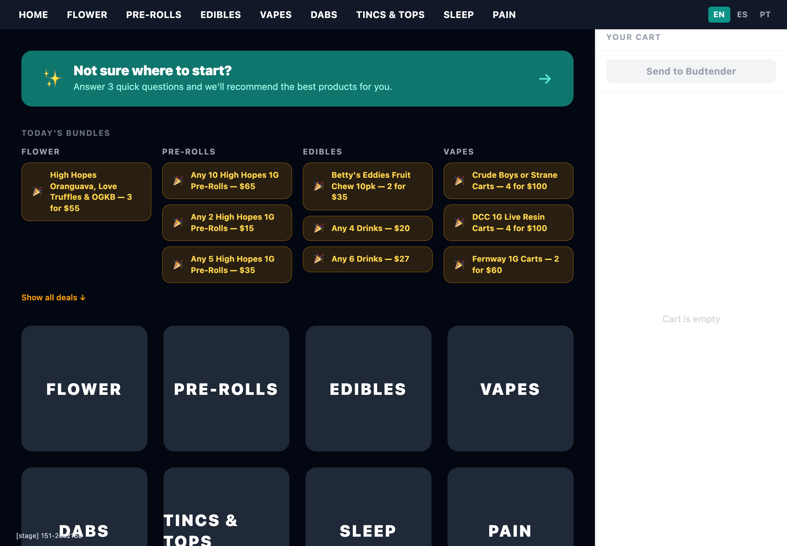

The kiosk home screen shows **category buttons** and any **active deals** at the top.

Customers who don't know what they want can tap **"Not sure where to start?"** to get guided recommendations.

---

## Guided recommendations

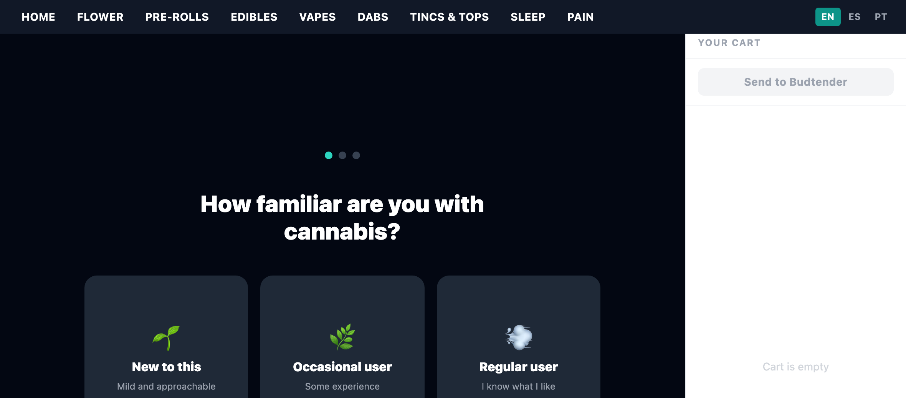

The guided flow asks **3 quick questions** — experience level, desired effect, and format preference — then shows personalized product suggestions.

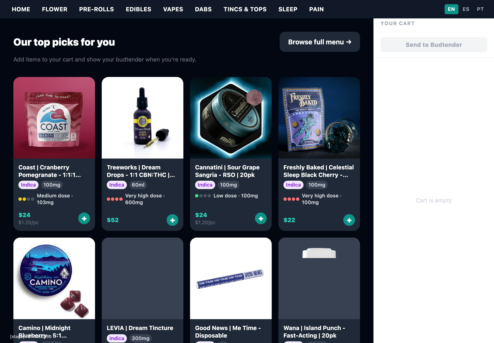

Customers can add items directly from the results, or tap **"Browse full menu"** to explore on their own.

---

## Browsing products

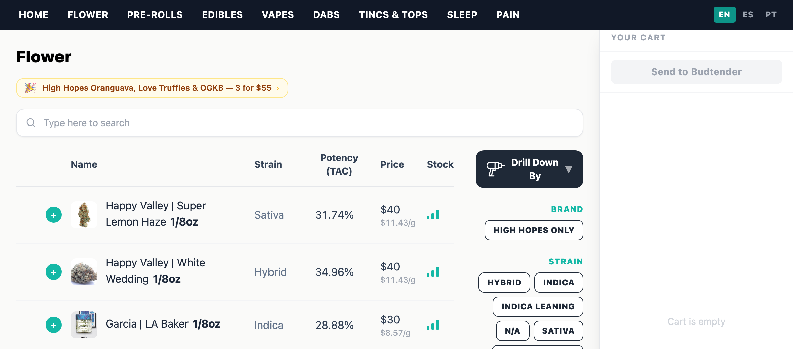

Each category page shows a **sortable product table**. Customers can tap any **product name** to open a detail modal with the image, description, price per gram, and an Add to Cart button.

The **Stock** column shows signal bars indicating inventory level:

- **1 red bar** = low stock (9 or fewer units)
- **2 amber bars** = moderate stock (10–19 units)
- **3 teal bars** = well stocked (20+ units)

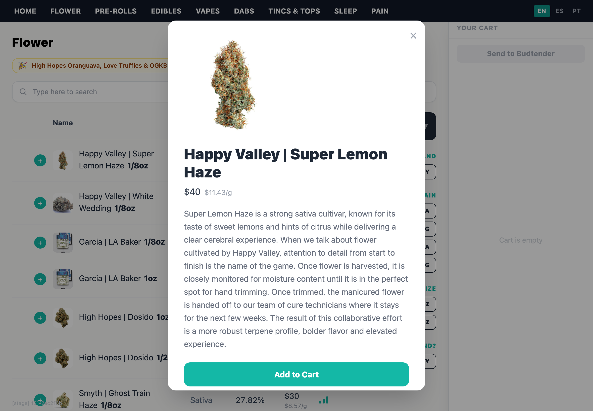

---

## Searching

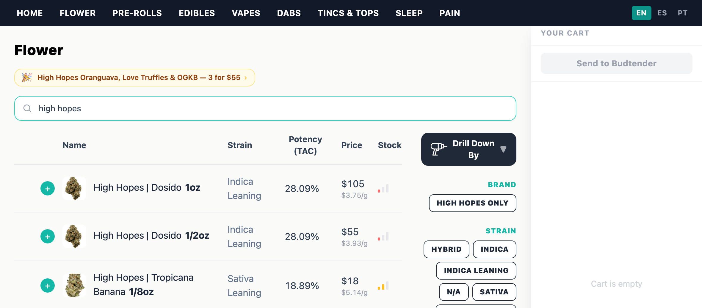

The **search box** at the top filters products in real time by name, brand, or strain.

---

## Sorting

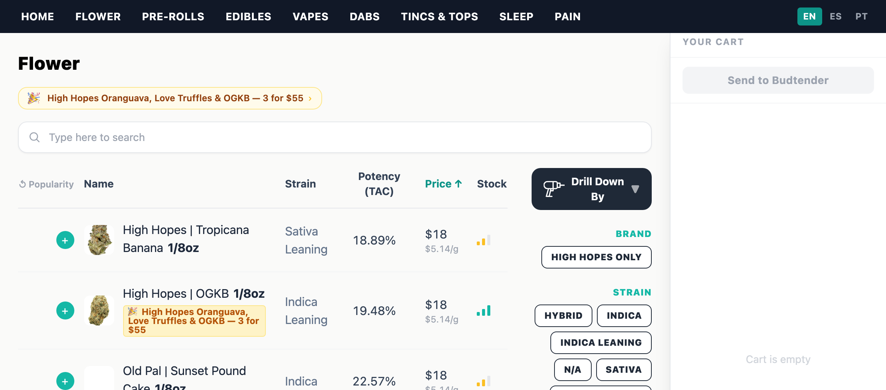

Tapping a **column header** (Name, Potency, Price) sorts the table. Tap again to reverse. The **"Popularity"** link to the left of the Name column resets back to the default order.

The **"Drill Down By"** button lets you narrow results by combining multiple filters at once — brand, strain, size, and more.

---

## Filters

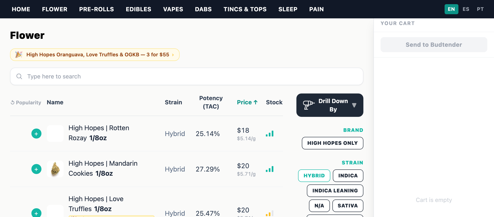

The right side of product pages has filter buttons for **strain type**, **size**, **brand**, and more. Active filters reduce the product list instantly.

---

## Subcategory tabs

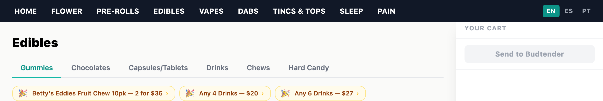

Some pages (like Edibles) have **tabs** at the top to switch between subcategories — Gummies, Chocolates, Drinks, etc.

---

## The cart

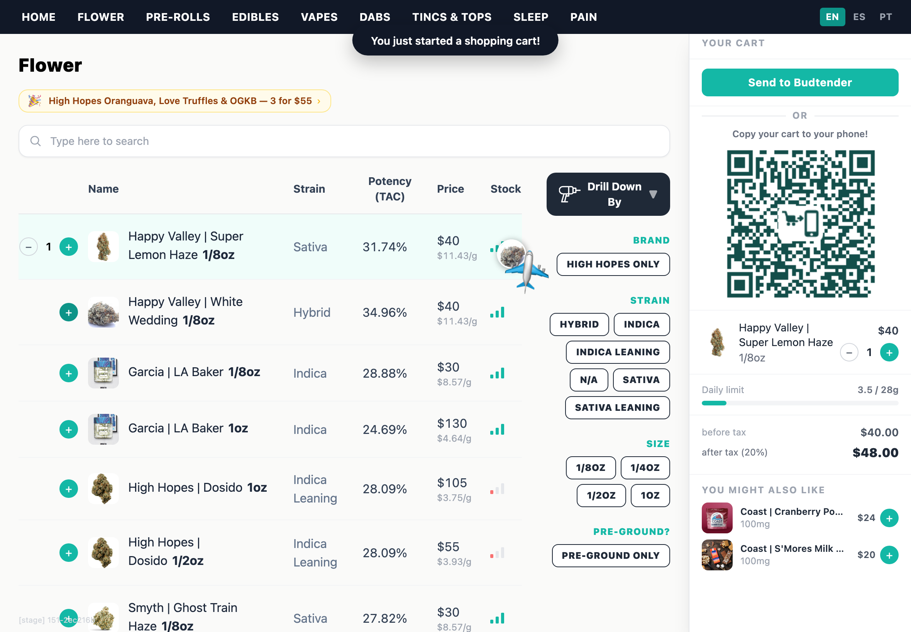

When a customer adds items, the **cart panel** appears on the right with a running total, a QR code to view the cart on their phone, and cross-sell suggestions under "You might also like."

The + button on any product row is a quick add. Once an item has a quantity of at least 1, a − button appears next to it for removing items.

---

## Send to Budtender

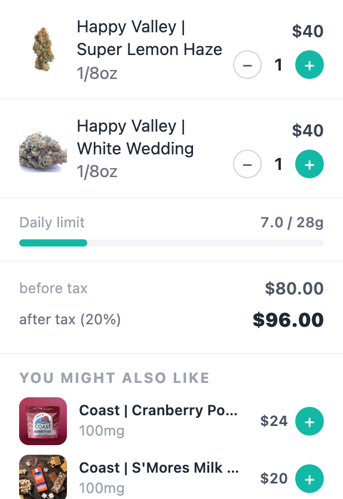

When the cart has items, the **Send to Budtender** button turns green. Tapping it sends the order to the budtender dashboard and gives the customer an order number.

---

## Deals

Active deals appear as **amber buttons** at the top of category pages. Customers tap a deal to see which products qualify and track their progress toward unlocking it.

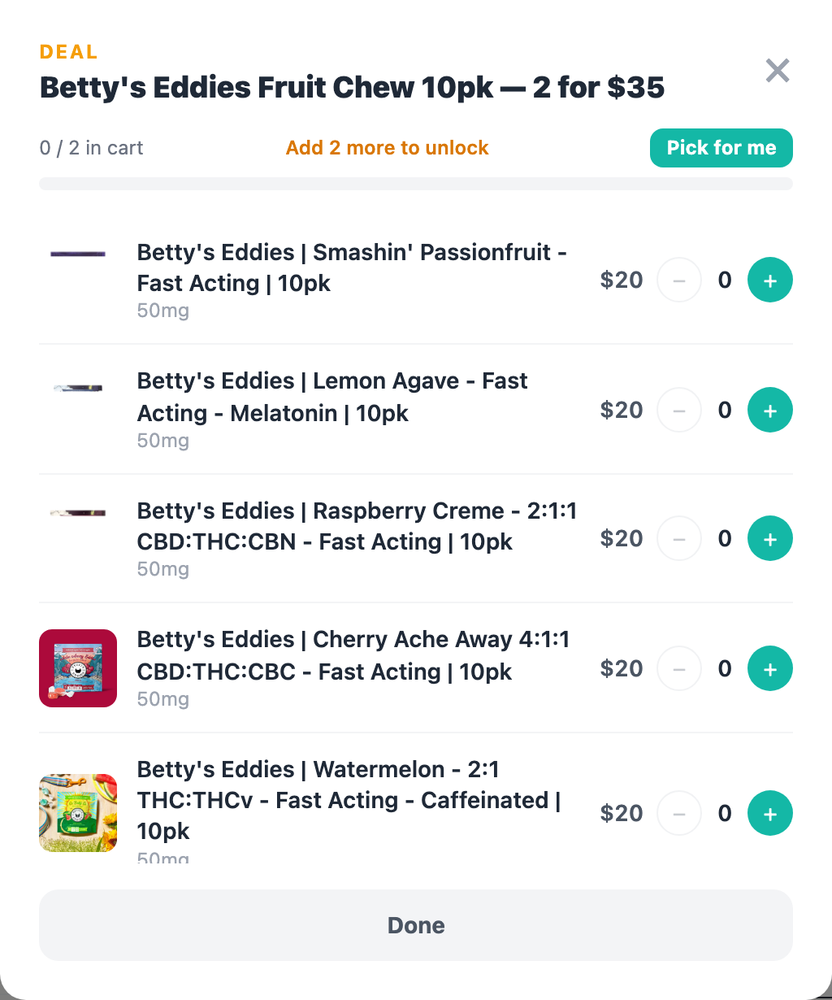

The deal modal shows qualifying products, a progress tracker, and a **"Pick for me"** button that auto-fills the deal with the cheapest qualifying items.

---

## Budtender dashboard

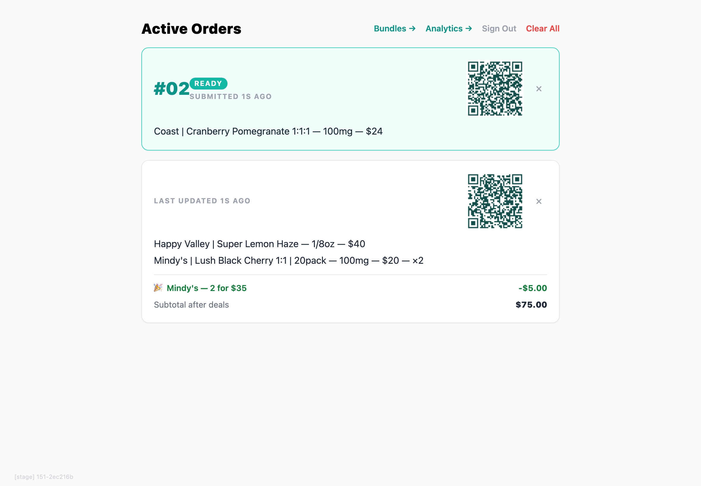

Go to **/budtender** on any browser (you'll need to sign in with your Microsoft account). This page shows all **active orders** and refreshes every second.

- **Ready orders** (green border, order number) = customer tapped "Send to Budtender"
- **In-progress orders** = customer is still browsing

Tap the **x** to dismiss an order after fulfilling it.

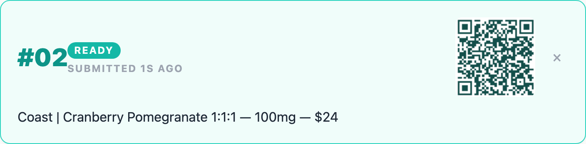

### Copy the cart to your phone for vault picking

Every order on the budtender page has a **QR code**. Scan it on your phone to copy the order — handy for bringing it into the vault to fill without having to memorize the list.

---

## Navigation bar

The top nav bar shows all categories. When a customer has items in their cart, a **count badge** appears.

---

## Auto-reset

The kiosk **automatically clears the cart and returns to the home page** after 2 minutes of no touches. This keeps it ready for the next customer.

---

## Language selector

The **EN / ES / PT** buttons in the top right corner switch the interface language between English, Spanish, and Portuguese.

---

## Staff-only pages

These pages require Microsoft sign-in and don't appear on the kiosk navigation:

| Page | URL | What it does |
|------|-----|-------------|
| **Budtender** | /budtender | View and manage active customer orders |
| **Bundles** | /bundles | Create, edit, and schedule deal bundles |
| **Analytics** | /analytics | View session and sales data |

Your sign-in session lasts **30 minutes**, then you'll need to sign in again.

---

## Tips

- **The kiosk is an iPad.** It's a web app running in Safari — no special hardware. If something looks wrong, try refreshing the page.
- **Products update automatically.** The menu pulls from Dutchie every 60 seconds. If a product is added or removed in Dutchie, it will appear or disappear on the kiosk within a minute.
- **Deals are managed at /bundles.** See the separate [Bundle Editor Guide](BUNDLE-EDITOR-GUIDE.md) for full instructions on creating and managing deals.
- **If the kiosk seems stuck,** tap anywhere to reset the inactivity timer, or refresh the browser. The cart will clear and the menu will reload.
